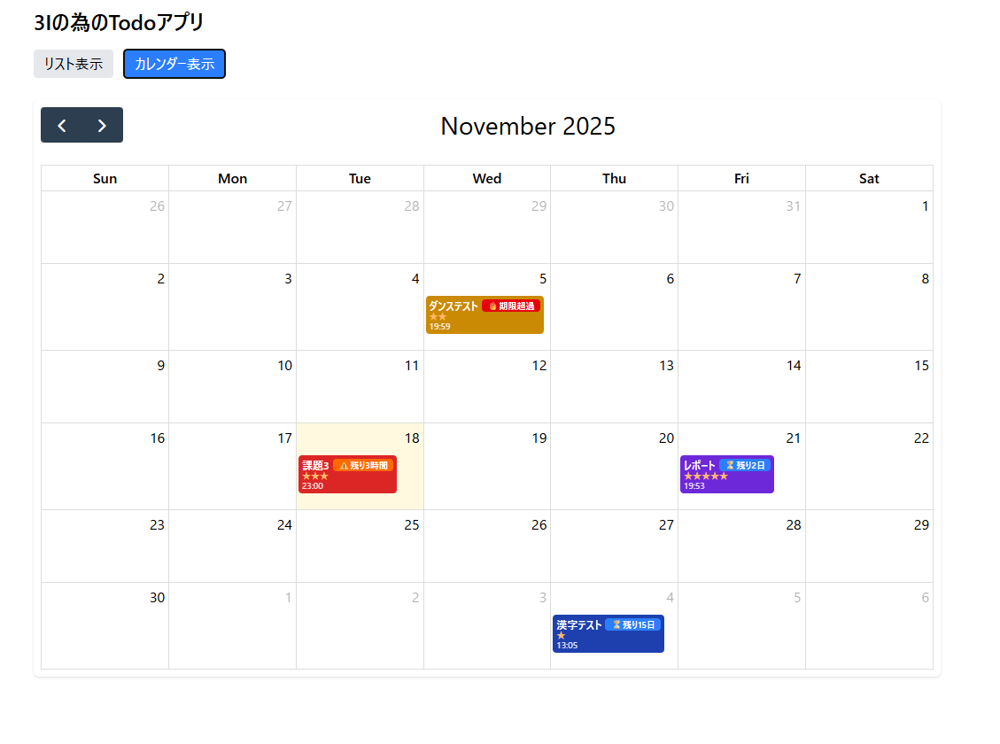
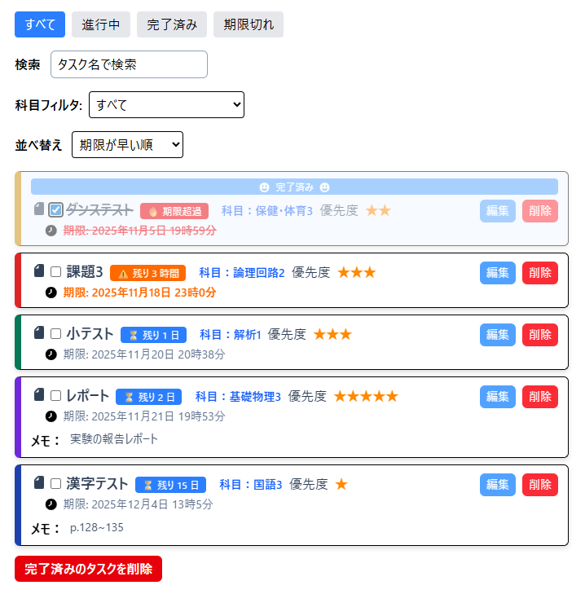
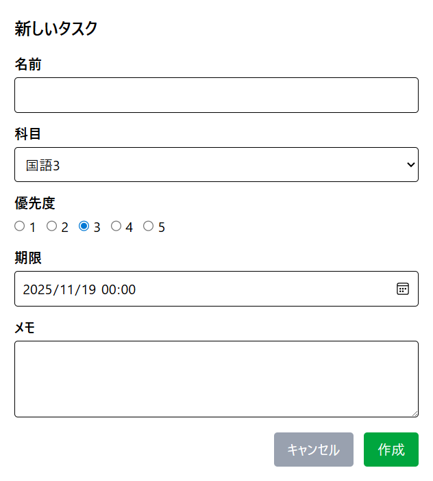
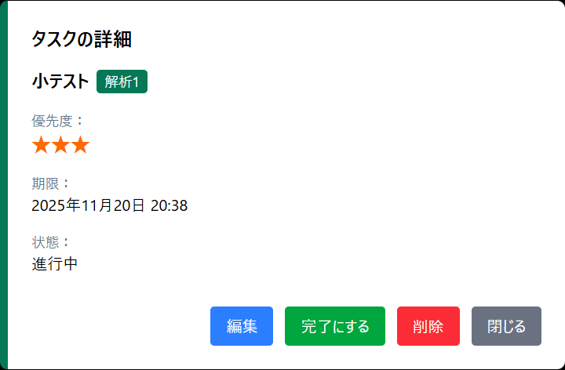

#  3I の為の Todo アプリ
https://github.com/tomo0778/react-todo-app

### ― 3Iの「課題管理」を効率化するための Todo アプリ ―

React / TypeScript / Tailwind CSS を使用し、  
**“学生が本当に使いやすいスケジュール管理ツール”** を目指して開発した Todo アプリです。

通常の Todo 管理だけでなく、

- **科目カラー管理**
- **優先度（★1〜5）**
- **期限の緊急度カラー**
- **残り時間バッジ**
- **カレンダー連動表示**

など、一般的なTodoアプリにはない「学生生活に特化した機能」を多数搭載しています。

---

# スクリーンショット

### リスト表示


---

### カレンダー表示


---

# 主な機能

## 1. タスクリスト管理
- タスク名 / 科目 / 優先度（★）/ 期限 / メモ  
- 完了チェック・編集・削除  
- リアルタイム検索  
- 科目フィルタ  
- 状態フィルタ（進行中 / 完了 / 期限切れ）  
- 並べ替え（期限順・優先度順）  
- 完了タスク一括削除  



---

## 2. 残り時間表示
期限を dayjs で自動解析して、直感的な "残り時間" を表示します。

例:
- 🔴 **期限切れ**


- 🟠 **残り3時間**


- 🔵 **残り7日**


視覚的に「優先して取り組むべき課題」がすぐわかる工夫をしています。

---

##  3. カレンダー表示（FullCalendar）
- 科目ごとに背景色を適用  
- タスク名・優先度（★）・提出時間を表示  
- 残り時間もカレンダー上に表示  


- 日付クリックで新規タスク作成 



---

##  4. タスク詳細モーダル
- タスククリックで詳細モーダル表示
- タスク内容を大きな画面で確認できる  
- ★1〜5 に完全対応  
- 科目カラーで統一したデザイン  
- 編集・削除がワンタッチ  



---

#  工夫したポイント・オリジナリティ

###  3Iに特化した情報設計
課題管理に必要な  
**科目 × 期限 × 優先度 × 進捗**  
の4軸を全て UI に自然に落とし込むことを重視しました。

### 優先度を「星の数」で表現
数字よりも直感的で実用的。

### 色での情報整理
- 科目カラーを常に統一  
- 緊急度は赤・橙・灰色で視覚化  
- カレンダーとリストで情報が一致するよう設計

### ⏳ 残り時間表示
他にはあまりない、完全オリジナルの情報設計。

### リスト ⇔ カレンダー の自然な切替
同じタスクを別の視点で見られるように UI を調整。

---

# 🛠 技術スタック

- **React 18**
- **TypeScript**
- **Tailwind CSS**
- **FullCalendar.js**
- **dayjs**
- **localStorage**

---

# 📂 インストール方法

```bash
git clone <your repo>
cd todoapp
npm install
npm run dev
```

## 開発履歴

- 2025年10月23日 ~ 2025.11.18 (約21時間)

## ライセンス

MIT License

Copyright (c) 2025 T.A.

Permission is hereby granted, free of charge, to any person obtaining a copy
of this software and associated documentation files (the "Software"), to deal
in the Software without restriction, including without limitation the rights
to use, copy, modify, merge, publish, distribute, sublicense, and/or sell
copies of the Software, and to permit persons to whom the Software is
furnished to do so, subject to the following conditions:

The above copyright notice and this permission notice shall be included in all
copies or substantial portions of the Software.

THE SOFTWARE IS PROVIDED "AS IS", WITHOUT WARRANTY OF ANY KIND, EXPRESS OR
IMPLIED, INCLUDING BUT NOT LIMITED TO THE WARRANTIES OF MERCHANTABILITY,
FITNESS FOR A PARTICULAR PURPOSE AND NONINFRINGEMENT. IN NO EVENT SHALL THE
AUTHORS OR COPYRIGHT HOLDERS BE LIABLE FOR ANY CLAIM, DAMAGES OR OTHER
LIABILITY, WHETHER IN AN ACTION OF CONTRACT, TORT OR OTHERWISE, ARISING FROM,
OUT OF OR IN CONNECTION WITH THE SOFTWARE OR THE USE OR OTHER DEALINGS IN THE
SOFTWARE.